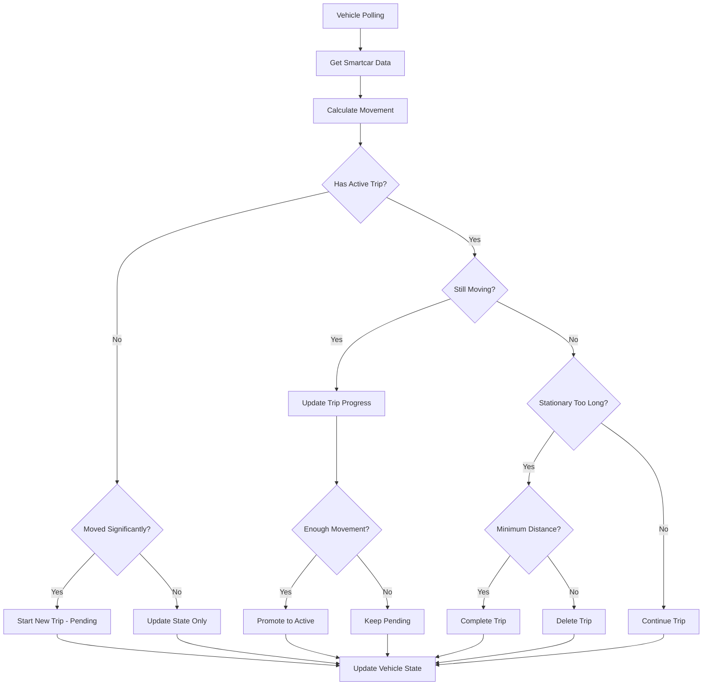

# Trip Detection Algorithm Documentation

## Overview
This document describes the automatic trip detection algorithm used to identify, track, and manage vehicle trips based on Smartcar API data.

## Core Concepts

### Trip States
- **`pending`** - Trip just started, waiting for confirmation of significant movement
- **`active`** - Confirmed ongoing trip with sufficient movement
- **`completed`** - Trip finished and saved
- **`paused`** - Future use for temporary stops

### Configurable Thresholds
All thresholds are stored in the `sense_profiles` table and can be customized per user:

| Setting | Default | Description |
|---------|---------|-------------|
| `trip_movement_threshold_meters` | 100m | Minimum movement to start a trip |
| `trip_stationary_timeout_minutes` | 2 min | Minutes without movement to end trip |
| `trip_minimum_distance_meters` | 500m | Minimum trip distance to keep trip |
| `trip_max_duration_hours` | 12h | Maximum trip duration (safety limit) |
| `trip_sensitivity_level` | 'normal' | Detection sensitivity (low/normal/high) |

## Algorithm Flow

### 1. Data Collection
- Polls Smartcar API for location and odometer data
- Compares with last known vehicle state
- Calculates movement distance using odometer difference

### 2. Movement Detection
```typescript
const movementDistance = Math.abs(currentOdometer - lastOdometer)
const hasMovedSignificantly = movementDistance >= tripConfig.movementThreshold
```

### 3. Trip Logic Decision Tree

#### No Active Trip + Significant Movement
- **Action**: Start new trip with `pending` status
- **Logic**: Vehicle has moved beyond threshold, potential trip starting

#### Active Trip + Continued Movement
- **Action**: Update trip distance/duration
- **Logic**: Trip is ongoing, update metrics
- **Promotion**: Pending trips become `active` after 2x movement threshold

#### Active Trip + No Movement (Stationary)
- **Check**: Time since last movement > `stationaryTimeout`
- **Action**: End trip if timeout exceeded
- **Filter**: Delete trip if distance < `minimumDistance`

#### Safety Mechanisms
- **Max Duration**: Force-complete trips exceeding `maxDurationHours`
- **Minimum Distance**: Delete trips shorter than `minimumDistance`
- **Error Recovery**: Handle API failures gracefully

### 4. Polling Frequency Optimization
Dynamic polling based on trip state:
- **Active + Moving**: 15 seconds
- **Active + Stationary**: 30 seconds  
- **No Active Trip + Recent Movement**: 30 seconds
- **No Activity**: 120 seconds (2 minutes)

## Configuration Examples

### Conservative Settings (Fewer Trips)
```sql
UPDATE sense_profiles SET 
  trip_movement_threshold_meters = 200,
  trip_stationary_timeout_minutes = 5,
  trip_minimum_distance_meters = 1000,
  trip_sensitivity_level = 'low'
WHERE id = 'user_id';
```

### Aggressive Settings (More Trips)
```sql
UPDATE sense_profiles SET 
  trip_movement_threshold_meters = 50,
  trip_stationary_timeout_minutes = 1,
  trip_minimum_distance_meters = 200,
  trip_sensitivity_level = 'high'
WHERE id = 'user_id';
```

## Data Flow



## Database Schema

### sense_trips Table
```sql
- id (uuid) - Unique trip identifier
- user_id (uuid) - Owner of the trip
- vehicle_connection_id (uuid) - Which vehicle
- start_time (timestamp) - Trip start time
- end_time (timestamp) - Trip end time (null if active)
- start_location (jsonb) - GPS coordinates
- end_location (jsonb) - GPS coordinates
- distance_km (numeric) - Trip distance
- duration_minutes (integer) - Trip duration
- trip_status (enum) - pending|active|completed
- trip_type (enum) - work|personal|unknown
- odometer_km (numeric) - Starting odometer reading
- is_automatic (boolean) - Auto-detected vs manual
```

### vehicle_states Table
```sql
- connection_id (uuid) - Vehicle connection
- last_odometer (numeric) - Last known odometer
- last_location (jsonb) - Last known GPS position
- last_poll_time (timestamp) - When last polled
- current_trip_id (uuid) - Active trip reference
- polling_frequency (integer) - Current poll interval
```

## Troubleshooting

### Too Many Short Trips
- Increase `trip_movement_threshold_meters`
- Increase `trip_minimum_distance_meters`
- Set `trip_sensitivity_level = 'low'`

### Missing Trips
- Decrease `trip_movement_threshold_meters`
- Decrease `trip_stationary_timeout_minutes`
- Set `trip_sensitivity_level = 'high'`

### Trips Never End
- Check `trip_stationary_timeout_minutes` setting
- Verify vehicle actually stops moving
- Check for API errors in logs

### Trips End Too Early
- Increase `trip_stationary_timeout_minutes`
- Check for GPS signal issues
- Verify odometer readings are consistent

## Monitoring & Logging

Key log entries to monitor:
- Movement analysis with thresholds
- Trip state changes
- Configuration values being used
- API errors from Smartcar
- Safety mechanism triggers

## Future Enhancements

### Planned Features
- [ ] Machine learning trip classification
- [ ] Speed-based trip detection
- [ ] Geofencing for work/home locations
- [ ] User feedback integration
- [ ] Advanced route tracking

### Configuration UI
Consider adding a settings page where users can adjust:
- Sensitivity levels
- Custom thresholds
- Trip preferences
- Notification settings

## Code Structure

### Main Files
- `supabase/functions/vehicle-trip-polling/index.ts` - Core algorithm
- `src/hooks/useVehicleTrip.tsx` - Frontend trip management
- `src/hooks/useTrips.tsx` - Trip data management

### Key Functions
- `analyzeTripState()` - Main decision logic
- `getUserTripConfig()` - Load user settings
- `startNewTrip()` - Create new trip
- `endTrip()` - Complete/delete trip
- `updateOngoingTrip()` - Update active trip

---

*Last updated: 2025-07-15*
*Algorithm version: 2.0*